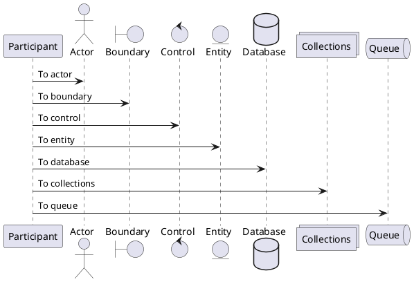
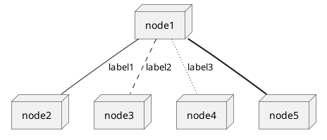

#### 时序图示例

```plantuml
@startuml
participant Participant as Foo
actor       Actor       as Foo1
boundary    Boundary    as Foo2
control     Control     as Foo3
entity      Entity      as Foo4
database    Database    as Foo5
collections Collections as Foo6
queue       Queue       as Foo7
Foo -> Foo1 : To actor
Foo -> Foo2 : To boundary
Foo -> Foo3 : To control
Foo -> Foo4 : To entity
Foo -> Foo5 : To database
Foo -> Foo6 : To collections
Foo -> Foo7: To queue
@enduml
```

#### 部署图示例

```plantuml
@startuml
node node1
node node2
node node3
node node4
node node5
node1 -- node2 : label1
node1 .. node3 : label2
node1 ~~ node4 : label3
node1 == node5
@enduml
```
